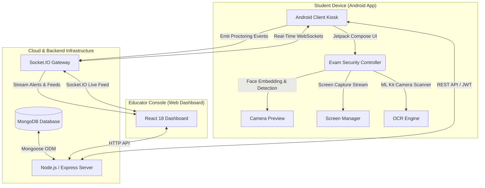

<div align="center">

# 🔒 CheatLock

### *Next-Generation AI-Powered Online Examination & Real-Time Anti-Cheating Platform*

[](https://developer.android.com/)
[](https://nodejs.org/)
[](https://expressjs.com/)
[](https://react.dev/)
[](https://www.mongodb.com/)
[](https://tailwindcss.com/)
[](LICENSE)

---

**CheatLock** is a full-stack, enterprise-grade automated exam proctoring and assessment platform. It combines a secure Android client app featuring AI-driven computer vision and OCR, a high-throughput Node.js/Socket.IO backend, and a feature-rich React proctoring web dashboard for educators.

[Explore Features](#-key-features) • [Architecture](#%EF%B8%8F-system-architecture) • [Getting Started](#-getting-started) • [API & WebSockets](#-api--websocket-events)

---

</div>

## 📌 Table of Contents

- [✨ Overview](#-overview)
- [🏗️ System Architecture](#%EF%B8%8F-system-architecture)
- [🌟 Key Features](#-key-features)
  - [📱 Android Examination App](#-android-examination-app)
  - [🖥️ Educator Web Dashboard](#%EF%B8%8F-educator-web-dashboard)
  - [⚡ Backend & Real-Time Engine](#-backend--real-time-engine)
- [📂 Project Structure](#-project-structure)
- [🚀 Getting Started](#-getting-started)
  - [Prerequisites](#prerequisites)
  - [1. Backend Server Setup](#1-backend-server-setup)
  - [2. Web Dashboard Setup](#2-web-dashboard-setup)
  - [3. Android App Setup](#3-android-app-setup)
- [⚙️ Environment Variables](#%EF%B8%8F-environment-variables)
- [📡 API & WebSocket Events](#-api--websocket-events)
- [🔒 Security & Integrity Mechanisms](#-security--integrity-mechanisms)
- [📄 License](#-license)

---

## ✨ Overview

Maintaining academic integrity in remote and digital examinations requires real-time vigilance without compromising user experience. **CheatLock** resolves this challenge by establishing an end-to-end ecosystem:

1. **Android Student Application**: Serves as a secure exam kiosk enforcing anti-cheat rules, real-time face detection, background screen streaming, and instant OCR paper digitization.
2. **Node.js & Express API Server**: Manages authentication, exam state machines, integrity event processing, and live WebSocket streaming.
3. **React Educator Dashboard**: Gives instructors live monitoring powers with video/screen feeds, AI anomaly alerts, replay timelines, attendance tracking, and automated reporting.

---

## 🏗️ System Architecture



---

## 🌟 Key Features

### 📱 Android Examination App
- 🔐 **Kiosk Security Mode**: Locks screen navigation, detects tab/app switches, blocks screenshots, and records security violations.
- 👤 **Real-Time AI Face Verification**: Tracks head pose, multi-face presence, and candidate absence using on-device face embeddings.
- 📷 **ML Kit OCR Scanner**: Allows candidates to scan handwritten physical answer sheets and digitize text seamlessly into digital answers.
- 📹 **Live Screen & Camera Streaming**: Transmits continuous proctoring metrics and screen frames back to proctors via WebSockets.
- 📲 **Quick QR Login**: Supports scanning QR codes generated from the web dashboard for instant candidate authentication and exam entry.
- 🛡️ **Offline Resiliency & Crash Recovery**: Saves local state periodically to restore active sessions in case of network drops or app restarts.

---

### 🖥️ Educator Web Dashboard
- 📺 **Live Grid Proctoring**: Multi-student video/screen grid showing real-time candidate connection status and live AI risk levels.
- ⏱️ **Event Replay Timeline**: Detailed post-exam audit trail displaying every flagged security incident with exact timestamps and snapshot evidence.
- 📝 **Exam & Question Bank Builder**: Create time-bounded exams with multiple question types, automated scoring rules, and student assignment lists.
- 📊 **Analytics & Integrity Reports**: Interactive data visualization powered by Recharts (class performance averages, flag distributions, attendance stats).
- 🏫 **Classroom & Community Hub**: Manage student rosters, generate registration tokens, and interact on teacher community boards.

---

### ⚡ Backend & Real-Time Engine
- 🔑 **Role-Based Access Control (RBAC)**: JWT authentication for **Student**, **Teacher**, and **Admin** roles.
- ⚡ **Bi-Directional Socket.IO Streaming**: Ultra-low latency event distribution for `proctoring_event`, `session_start`, `cheat_flag`, and `notification`.
- 📁 **Mongo Database Models**: Production-ready schemas for `User`, `Exam`, `ExamSession`, `Submission`, `ProctoringEvent`, `IntegrityReview`, and `TeacherClass`.
- 🛡️ **Automated Risk Scoring Engine**: Calculates integrity risk indices dynamically based on event severity and violation frequency.

---

## 📂 Project Structure

```
cheatLock_App/
├── app/                        # 📱 Android Native App (Kotlin, Jetpack Compose)
│   ├── src/main/java/com/jubayer/cheatlock/
│   │   ├── ocr/                # ML Kit Image Processing & Answer Extraction
│   │   ├── proctoring/         # Face Embedding, Screen Capture & Security Control
│   │   ├── security/           # Kiosk Security Controller & Violation Handlers
│   │   ├── ui/                 # Jetpack Compose Screens (Exam, Login, Student/Teacher Dashboards)
│   │   └── util/               # Backend Connection Probes & Dynamic URL Resolvers
│   └── build.gradle.kts
│
├── backend/                    # ⚡ Node.js & Express REST / WebSocket Server
│   ├── src/
│   │   ├── middleware/         # JWT Auth & Role Validation
│   │   ├── models/             # Mongoose Schemas (User, Exam, Session, ProctoringEvent)
│   │   ├── routes/             # Express API Endpoints (Auth, Exams, Submissions, Classes)
│   │   ├── socket/             # Socket.IO Proctoring Room Handlers
│   │   └── server.js           # Main Entry Point & HTTP/WS Bootstrapper
│   └── package.json
│
└── web-dashboard/             # 🖥️ Web Proctoring Console (React 18, Vite, TypeScript, Tailwind)
    ├── src/
    │   ├── components/         # Reusable UI Components & Navigation Shell
    │   ├── lib/                # Axios Client, Auth Helpers & Socket.IO Listener
    │   └── pages/              # Live Proctoring, Exam Details, Reports, Replay Timeline
    ├── package.json
    └── vite.config.ts
```

---

## 🚀 Getting Started

### Prerequisites

Ensure you have the following installed on your machine:
- **Node.js**: `v18.0.0` or higher
- **npm**: `v9.0.0` or higher
- **MongoDB**: Local instance or [MongoDB Atlas](https://www.mongodb.com/cloud/atlas) URI
- **JDK**: Version 17+ (for Android compilation)
- **Android Studio**: Ladybug / Hedgehog or newer (Android SDK API Level 34+)

---

### 1. Backend Server Setup

```bash
# Navigate to the backend directory
cd backend

# Install dependencies
npm install

# Create environment configuration file
cp .env.example .env
```

Edit your `.env` file with appropriate credentials (see [Environment Variables](#%EF%B8%8F-environment-variables)).

```bash
# Start the development server with live reload
npm run dev
```
*The backend server will run on `http://localhost:5000` (or your configured `PORT`).*

---

### 2. Web Dashboard Setup

```bash
# Open a new terminal and navigate to web-dashboard
cd web-dashboard

# Install dependencies
npm install

# Start the Vite development server
npm run dev
```
*Access the Web Dashboard in your browser at `http://localhost:5173`.*

---

### 3. Android App Setup

1. Open **Android Studio**.
2. Select **Open** and choose the `app` or root `cheatLock_App` directory.
3. Allow Gradle to sync dependencies (`Jetpack Compose`, `ML Kit`, `Socket.IO Client`, `CameraX`).
4. Ensure your local backend IP is set in `BackendUrlStore.kt` or test against your local server address (e.g., `http://10.0.2.2:5000` for Android Emulator or your LAN IP for physical device).
5. Build and run on an Emulator or connected Android physical device (Android 8.0+ / API 26+).

---

## ⚙️ Environment Variables

### Backend (`backend/.env`)

| Variable | Description | Default / Example |
| :--- | :--- | :--- |
| `PORT` | HTTP & WebSocket server port | `5000` |
| `MONGODB_URI` | Connection string for MongoDB database | `mongodb://localhost:27017/cheatlock` |
| `JWT_SECRET` | Secret key for signing JSON Web Tokens | `your_super_secret_jwt_key` |
| `CLIENT_ORIGIN` | Allowed CORS origin for Web Dashboard | `http://localhost:5173` |

### Web Dashboard (`web-dashboard/.env`)

| Variable | Description | Default / Example |
| :--- | :--- | :--- |
| `VITE_API_URL` | Base HTTP endpoint for Express backend | `http://localhost:5000/api` |
| `VITE_SOCKET_URL` | Base WebSocket endpoint for Socket.IO | `http://localhost:5000` |

---

## 📡 API & WebSocket Events

### Selected REST Endpoints

| Method | Endpoint | Description | Auth Required |
| :--- | :--- | :--- | :---: |
| `POST` | `/api/auth/register` | Register new user (Student / Teacher) | ❌ |
| `POST` | `/api/auth/login` | Authenticate & retrieve JWT token | ❌ |
| `GET` | `/api/exams` | Fetch all exams (filtered by role) | ✅ |
| `POST` | `/api/exams` | Create a new exam with questions | ✅ (Teacher) |
| `POST` | `/api/sessions/start` | Start an active exam session | ✅ (Student) |
| `POST` | `/api/submissions` | Submit exam answers & digitized OCR text | ✅ (Student) |
| `GET` | `/api/proctoring/events/:sessionId` | Get security event logs for replay timeline | ✅ (Teacher) |

### Real-Time Socket.IO Events

- **Client ➡️ Server**:
  - `join_exam_session`: Candidate joins live proctoring room.
  - `proctoring_event`: Transmits detected anomalies (e.g., `LOOKING_AWAY`, `MULTIPLE_FACES`, `TAB_SWITCH`).
  - `screen_frame`: Sends live compressed screen stream.
- **Server ➡️ Client**:
  - `student_flagged`: Emits real-time warning to proctor dashboard when a violation occurs.
  - `session_terminated`: Forces candidate app closure upon proctor revocation.

---

## 🔒 Security & Integrity Mechanisms

- **Dynamic Token Verification**: All socket connections & HTTP requests require valid JWT headers.
- **On-Device Machine Learning**: Face detection and OCR execute locally on client hardware to preserve candidate privacy and minimize latency.
- **Tamper-Evident Logs**: Event snapshots are timestamped and cryptographically linked to active exam session IDs.

---

## 📄 License

Distributed under the **MIT License**. See `LICENSE` for more information.

---

<div align="center">

Made with ❤️ by the **CheatLock Team**

[](https://github.com/jubayer032003/cheatLock_App)

</div>
